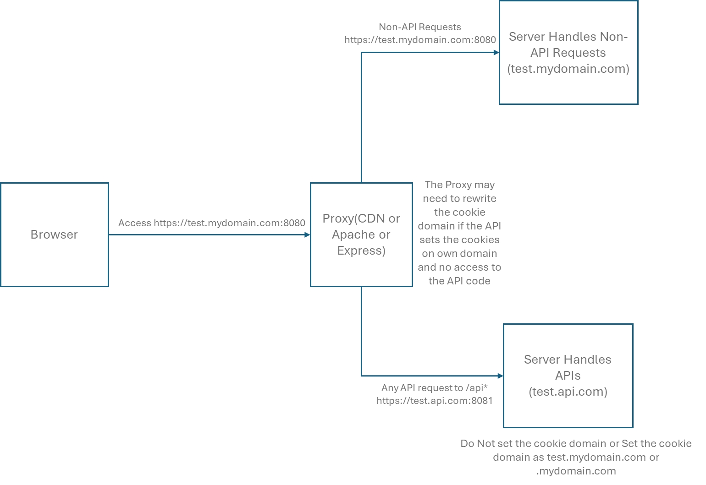

# Testing Cross Domain Cookie Scenarios

The application running on https://test.mydomain.com:8080 invokes an API at https://test.api.com:8081 from the client side. The API sets a cookie, and this cookie should be available for test.mydomain.com. Additionally, all subsequent requests to https://test.mydomain.com should include the cookie.

In a cross-domain context, the request to the https://test.api.com:8081 API service cannot set the cookie for test.mydomain.com or the root domain .mydomain.com due to browser restrictions. The browser rejects the cookie in this scenario.

To solve this problem, we should proxy the calls to /api through the same domain. If a CDN is used, let the CDN send the /api calls to the API servers. Alternatively, proxy servers like Apache can be used. If not, the server handling the https://test.mydomain.com request can proxy the API requests to the https://test.api.com API server. Now, the API can either avoid setting the cookie domain (so the browser uses the current domain as the cookie domain, in our case test.mydomain.com) or directly set the cookie on test.mydomain.com or .mydomain.com. This will ensure that the cookie is available for test.mydomain.com in the browser, and subsequent requests will receive the same cookie.

If the cookie needs to be set dynamically based on the requesting domain, the Referrer header can be used to fetch the domain and set the cookie accordingly.

In case you do not have control over the API to set the cookies on your original domain, the proxy should rewrite the cookie domain of the API response to the actual domain before sending the response to the client.

In a forward flow, you should forward the cookie to the API domain. Most proxies support this.

This approach is useful when integrating with various applications and the requirement is for the user to always see the same domain, and for all domains to have access to the same cookies.
<br/>
<br/>
<br/>



## Sample

For the demo in this code, I am using two Express servers. The server.js receives all the requests (non-API and API requests) on https://test.mydomain.com:8080, handles non-API requests locally, and proxies the API requests (/api) to another Express server (api-server.js) running on https://test.api.com:8081.

The API sets the cookie on .mydomain.com (the client root domain is fetched through the Referer header). This same cookie is available to test.mydomain.com in the browser, and subsequent requests to test.mydomain.com or any subdomains under mydomain.com will receive the cookie.

#### Setup Instructions

```
cd Cross-Domain-Cookies
npm install
node server.js
node api-server.js
```

Now access https://test.mydomain.com:8080. The cookie from the API will be set on .mydomain.com.

