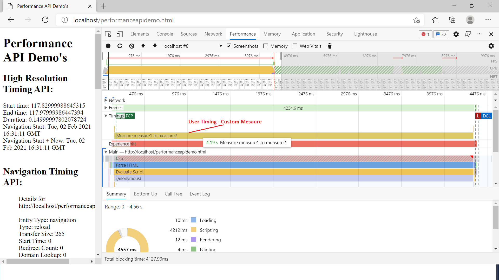

# Performance API Demo

The Performance API provides access to performance-related information for the current page. It's part of the High Resolution Time API, but is enhanced by the Performance Timeline API, the Navigation Timing API, the User Timing API, and the Resource Timing API

The High Resolution Time standard defines a Performance interface that supports client-side latency measurements within applications. The Performance interfaces are considered high resolution because they are accurate to a thousandth of a milliseconds

### High Resolution Time

```
interface Performance {
DOMHighResTimeStamp now();
readonly attribute DOMHighResTimeStamp timeOrigin;
object toJSON();
};

window.performance.now(); 
window.performance.timeorigin;
```
The DOMHighResTimeStamp type, as its name implies, represents a high resolution point in time. The DOMHighResTimeStamp type is a double and is used to store a time value in milliseconds

### Performance Timeline

The Performance Timeline API is an extension of the Performance API. The extension provides interfaces to retrieve performance metrics based on specific filter criteria.

The Performance Timeline API extends the Performance interface with three methods that provide different mechanisms to get a set of performance records (metrics), depending on the specified filter criteria.

```
partial interface Performance {
	PerformanceEntryList getEntries();
	PerformanceEntryList getEntriesByType(DOMString type);
	PerformanceEntryList getEntriesByName(DOMString name,
	  optional DOMString type);
};
```

### PerformanceEntry

The PerformanceEntry object encapsulates a single performance metric that is part of the performance timeline. A performance entry can be directly created by making a performance mark or measure (for example by calling the mark() method) at an explicit point in an application. Performance entries are also created in indirect ways such as loading a resource

PerformanceEntry instances will always be one of the following subtypes:

```
PerformanceMark
PerformanceMeasure
PerformanceFrameTiming
PerformanceNavigationTiming
PerformanceResourceTiming
PerformancePaintTiming

interface PerformanceEntry {
	readonly attribute DOMString name;
	readonly attribute DOMString entryType;
	readonly attribute DOMHighResTimeStamp startTime;
	readonly attribute DOMHighResTimeStamp duration;
};
```

### Navigation Timing API

The Navigation Timing API provides data that can be used to measure the performance of a web site. 

The Navigation Timing API helps measure real user data (RUM) such as bandwidth, latency, or the overall page load time for the main page. 

### PerformanceNavigationTiming 

Provides methods and properties to store and retrieve metrics regarding the browser's document navigation events. For example, this interface can be used to determine how much time it takes to load or unload a document.

```
performance.getEntriesByType("navigation")

entryType: "navigation"
name: URL
startTime: 0
duration: total time until after onload
type: "navigate", "reload", "back_forward", ...
transferSize, encodedBodySize, decodedBodySize
nextHopProtocol: "http/1.1", "h2", ...
```

### Resource Timing API

The Resource Timing API provides a way to retrieve and analyze detailed network timing data regarding the loading of an application's resource(s). An application can use the timing metrics to determine, for example, the length of time it takes to fetch a specific resource such as an XMLHttpRequest, <SVG>, image, script, etc.).

The PerformanceResourceTiming interface enables retrieval and analysis of detailed network timing data regarding the loading of an application's resources.

```
performance.getEntriesByType("resource")

PerformanceResourceTiming.startTime... 
PerformanceResourceTiming.initiatorType:
"script", "link", or "img" for HTML 
"css" for fonts, background images etc.
"xmlhttprequest" for XMLHttpRequest
"beacon" for sendBeacon 
"" for fetch(), new Worker() etc.
```

### Paint Timing API

The PerformancePaintTiming interface of the Paint Timing API provides timing information about "paint" (also called "render") operations during web page construction.

```
performance.getEntriesByType("paint")
```
"first-paint" - when the browser first rendered after navigation
"first-contentful-paint" - when the browser first rendered any text, image, non-white canvas or SVG

### User Timing API

The User Timing interface allows the developer to create application specific timestamps that are part of the browser's performance timeline. There are two types of user defined timing entry types: the "mark" entry type and the "measure" entry type.

mark events are named by the application and can be set at any location in an application. measure events are also named by the application but they are placed between two marks thus they are effectively a midpoint between two marks.

```
partial interface Performance {
	void mark(DOMString markName);
	void clearMarks(optional DOMString markName);
	void measure(DOMString measureName,
             	optional DOMString startMark,
             	optional DOMString endMark);
	void clearMeasures(optional DOMString measureName);
};

performance.getEntriesByName(YourMark); 
```
Dev Tool - Performance tab displayes the User Timing(performance measures's) in the timeline



## Prerequisites

Node JS/NPM

## Installing

Steps to run

```
cd to the project folder
npm install
node app.js
```

## Demo URL's

```
http://localhost/performanceapidemo.html

```